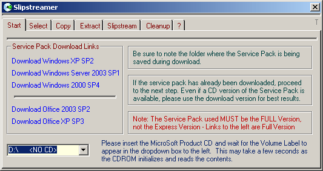



## Slipstreamer

### Description

Windows XP, 2000, 2003[Server], Office XP and 2003 can be "slipstreamed" or made to have the latest service pack integrated before installation. This is an 'almost finished' project that completes the operation by tab-to-tab selection in the GUI. Although not well commented, most of the code is straightforeward and easily deduced. If I get a few votes on this, I'll try to finish it in it's entirety and post updates(s).
 
### More Info
 
Reads CDROM volume

Assumes you have downloaded the specified service pack for a particular application. Use the links in program to obtain the correct one.

"Slipstreams" service packs into MS products.

Heavy processor consumption under certain circumstances

             |
---                |---
**Submitted On**   |2006-03-08 17:27:46
**By**             |[M1K3](https://github.com/Planet-Source-Code/PSCIndex/blob/master/ByAuthor/m1k3.md)
**Level**          |Advanced
**User Rating**    |4.5 (36 globes from 8 users)
**Compatibility**  |VB 6\.0
**Category**       |[Complete Applications](https://github.com/Planet-Source-Code/PSCIndex/blob/master/ByCategory/complete-applications__1-27.md)
**World**          |[Visual Basic](https://github.com/Planet-Source-Code/PSCIndex/blob/master/ByWorld/visual-basic.md)
**Archive File**   |[Slipstream197884382006\.zip](https://github.com/Planet-Source-Code/m1k3-slipstreamer__1-64586/archive/master.zip)

### API Declarations

In the modules

